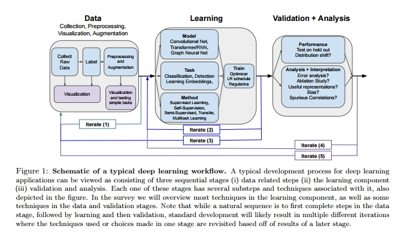

## 2 High Level Considerations for Deep Learning

In this section we first discuss some high level considerations for deep learning techniques. 
We start with overviews of template ways in which deep learning might be applied in scientific settings, followed by a discussion of the end-to-end design process and some brief highlights of alternate machine learning methods which may be more suited to some problems.

在本节中，我们首先讨论深度学习技术的一些高级思想。 我们首先概述了深度学习在科学环境中应用的模板方式，然后讨论了端到端的设计过程，并简要介绍了可能更适合某些问题的替代机器学习方法。

### 2.1 Templates for Deep Learning in Scientific Settings

What are the general ways in which we might apply deep learning techniques in scientific settings? 
At a very high level, we can offer a few templates of ways in which deep learning might be used in such problems:
1. *Prediction Problems* 
   Arguably the most straightforward way to apply deep learning is to use it to tackle important prediction problems: mapping inputs to predicted outputs. 
   This predictive use case of deep learning is typically how it is also used in core problems in computing and machine learning. 
   For example, the input might be a biopsy image, and the model must output a prediction of whether the imaged tissue shows signs of cancer. 
   We can also think of this predictive use case as getting the model to learn a target function, in our example, mapping from input visual features to the cancer/no cancer output. 
   Using deep learning in this way also encapsulates settings where the target function is very complex, with no mathematical closed form or logical set of rules that describe how to go from input to output. 
   For instance, we might use a deep learning model to (black-box) simulate a complex process (e.g. climate modelling), that is very challenging to explicitly model [101].
2. *From Predictions to Understanding*
   One fundamental difference between scientific questions and core machine learning problems is the emphasis in the former on understanding the underlying mechanisms. 
   Oftentimes, outputting an accurate prediction alone is not enough. 
   Instead, we want to gain interpretable insights into what properties of the data or the data generative process led to the observed prediction or outcome. 
   To gain these kinds of insights, we can turn to interpretability and representation analysis methods in deep learning, which focus on determining how the neural network model makes a specific prediction. 
   There has been significant work on both tools to understand what features of the input are most critical to the output prediction, as well as techniques to directly analyze the hidden representations of the neural network models, which can reveal important properties of the underlying data.
3. *Complex Transformations of Input Data* 
   In many scientific domains, the amount of generated data, particularly visual data (e.g. fluorescence microscopy, spatial sequencing, specimen videos [177, 97]) has grown dramatically, and there is an urgent need for efficient analysis and automated processing. 
   Deep learning techniques, which are capable of many complex transformations of data, can be highly effective for such settings, for example, using a deep neural network based segmentation model to automatically identify the nuclei in images of cells, or a pose estimation system to rapidly label behaviors seen in videos of mice for neuroscience analysis.

我们在科学环境中应用深度学习技术的一般方法是什么？
在一个非常高的层次上，我们可以提供一些深度学习可能用于解决这些问题的方法模板:
1. *预测问题*
   
   可以说，应用深度学习最直接的方法就是用它来解决重要的预测问题: 将输入映射到预测的输出。
   这种深度学习的预测用例通常也用于计算和机器学习的核心问题。
   例如，输入的可能是活检图像，模型必须输出一个预测：即图像组织是否显示癌症迹象。
   我们也可以把这个预测用例看作是让模型学习一个目标函数，在我们的例子中，从输入视觉特征映射到癌症或无癌症输出。
   通过这种方式使用深度学习还可以封装目标函数非常复杂的设置，没有数学封闭形式或描述如何从输入到输出的逻辑规则集。
   例如，我们可以使用深度学习模型 (黑匣子) 来模拟一个复杂的过程 (例如气候建模) ，这对于明确地建模 [101] 是非常具有挑战性的。
2. *从预测到理解*

   科学问题和核心机器学习问题的一个根本区别在于前者强调要理解潜在的机制。
   通常，仅仅输出一个准确的预测是不够的。
   相反，我们希望获得可解释的洞察 (机制)，以了解数据或数据生成过程的哪些属性导出了观察到的预测或结果。
   为了获得这些洞察 (机制)，我们可以转向深度学习的解释性和表征性分析方法，这些方法着重于确定神经网络模型如何作出具体的预测。
   这两种方法已经有了一些重要的工作，以了解输入的什么特征对于输出预测最关键，还有一些技术，直接分析神经网络模型的隐藏表示，这可以揭示底层数据的重要属性
3. *输入数据的复杂转换*
   
   在许多科学领域，生成的数据的数量急剧增加，特别是视觉数据 (如荧光显微镜、空间序列、标本视频 [177,97])，迫切需要有效的分析和自动化处理。
   深度学习技术能够进行许多复杂的数据转换，对于这样的情况非常有效，例如，使用基于深度神经网络的分割模型来自动识别细胞图像中的细胞核，或者使用姿势估计系统来快速标记小鼠视频中的行为以供神经科学分析。

### 2.2 Deep Learning Workflow
With these examples of templates for deep learning applications in science, we next look at the end to end workflow for designing a deep learning system. 
**Figure 1** illustrates what a typical workflow might look like.

Having selected the overarching (predictive) problem of interest, we can broadly think of having three stages for designing and using the deep learning system: (i) data related steps, such as collection, labelling, preprocessing, visualization, etc (ii) learning focused steps, such as choice of deep neural network model, the task and method used to train the model (iii) validation and analysis steps, where performance evaluations are conducted on held out data, as well as analysis and interpretation of hidden representations and ablation studies of the overall methods.
These three stages are naturally sequential. 
However, almost all of the time, the first attempt at building an end-to-end deep learning system will result in some kind of failure mode. 
To address these, it is important to keep in mind the iterative nature of the design process, with results from the different stages informing the redesign and rerunning of other stages.
**Figure 1** provides some examples of common iterations with the backward connecting arrows: 
1. the Iterate (1) arrow, corresponding to iterations on the data collection process, e.g. having performed some data visualization, the labelling process for the raw instances might require adjusting — the first labelling mechanism might be too noisy, or not capture the objective of interest 
2. the Iterate (2) arrow, corresponding to iterations on the learning setup, due to e.g. deciding that a different task or method might be more appropriate, or decomposing the learning process into multiple steps — first performing self-supervision followed by supervised learning 
3. the Iterate (3) arrow, changing the data related steps based off of the results of the learning step 
4. the Iterate (4) arrow, redesigning the learning process informed by the validation results e.g. finding out the model has overfit on the training data at validation and hence reducing training time or using a simpler model 
5. the Iterate (5) arrow, adapting the data steps based off the validation/analysis results, e.g. finding that the model is relying on spurious attributes of the data, and improving data collection/curation to mitigate this.

Focus of Survey and Nomenclature In this survey, we provide a comprehensive overview of many of the techniques in the learning stage, along with some techniques (e.g. data augmentation, interpretability and representation analysis, Section 7) in the data and validation stages.
For the learning stage, we look at popular models, tasks and methods. 
By models (also sometimes referred to as architecture), we mean the actual structure of the deep neural network — how many layers, of what type, and how many neurons, etc. 
By tasks, we mean the kind of prediction problem, specifically, the type of input and output. 
For example, in an image classification task, the input consists of images and the output a probability distribution over a (discrete) set of different categories (called classes). 
By methods, we refer to the type of learning process used to train the system. 
For example, supervised learning is a very general learning process, consisting of the neural network being given data instances with corresponding labels, with the labels providing supervision. 
Unlike different models and tasks, methods can be subsets of other methods. 
For example, self-supervision, a method where the neural network is trained on data instances and labels, but the labels automatically created from the data instance, can also be considered a type of supervised learning. 
This can be a little confusing! But it suffices to keep in mind the general notions of models, tasks and methods.

### 2.2 深度学习工作流
通过这些用于科学中深度学习应用的模板示例，我们接下来研究用于设计深度学习系统的端到端工作流。
**图 1** 说明了一个典型的工作流可能是什么样子。
在选择了感兴趣的首要 (预测) 问题之后，我们可以大致地认为深度学习系统的设计和使用分为三个阶段: 
1. 数据相关步骤，如收集、标记、预处理、可视化等; 
2. 学习重点步骤，如深度神经网络模型的选择; 用于训练模型的任务和方法; 
3. 验证和分析步骤，其中对流出的进行性能评估; 以及对隐藏表示的分析和解释以及总体方法的消融研究。
这三个阶段是自然顺序的。
然而，几乎所有时候，第一次尝试构建端到端的深度学习系统都会导致某种失败模式。
为了解决这些问题，重要的是牢记设计过程的迭代性质，用不同阶段的结果信息来重新设计和重新运行其他阶段。
**图 1** 提供了一些使用反向连接箭头的常见迭代示例: 
1. 迭代 (1) 箭头，对应于数据收集过程中的迭代，
   例如在执行了一些数据可视化后，原始实例的标签过程可能需要调整——第一个标签机制可能带有太多噪声，或者不能捕获感兴趣的目标
2. 迭代 (2) 箭头，对应于学习过程中的迭代，例如一个不同的任务或方法可能更合适，或者将学习过程分解为多个步骤——首先执行自监督，然后执行监督学习
3. 迭代 (3) 箭头，根据学习步骤的结果更改与数据相关的步骤
4. 迭代 (4) 箭头，根据验证结果提供信息重新设计学习过程。 例如发现模型在验证时对训练数据过拟合，从而减少训练时间或使用更简单的模型
5. 迭代 (5) 箭头，根据验证 / 分析的结果调整数据步骤，例如:发现该模型依赖于数据的虚假属性，改进数据收集 / 管理来缓解这一问题。

**调查和命名的重点**

在这一调查中，我们提供了在学习阶段的许多技术的全面概述，以及在数据和验证阶段的一些技术(例如数据增强，解释性和表示分析，第7章)。
在学习阶段，我们关注流行的模型、任务和方法。 
* 对于模型(有时也称为架构) ，我们指的是深层神经网络的实际结构——有多少层、什么类型、有多少神经元等等。
* 所谓任务，我们指的是预测问题，特别是输入和输出的类型。
  例如，在一个图像分类任务中，输入由图像组成，输出由一组不同类别(称为类)的离散概率分布组成。
* 采用的方法，我们指的是用于训练系统的学习过程的类型。
  例如，监督式学习是一个非常普遍的学习过程，由神经网络被给予数据实例和相应的标签，标签提供监督。
  不像不同的模型和任务之间，方法可以是其他方法的子集。
  例如，自监督，一种神经网络在数据实例和标签上训练的方法，但是标签根据数据实例自动创建，也可以被认为是一种监督式学习。

这可能有点令人困惑！ 但是只要记住模型、任务和方法的一般概念就足够了。

### 2.3 Deep Learning or Not?
As a final note before diving into the different deep learning techniques, when formulating a problem, it is important to consider whether deep learning provides the right set of tools to solve it. 
The powerful underlying neural network models offer many sophisticated functionalities, such learned complex image transforms. 
However, in many settings, deep learning may not be the best technique to start with or best suited to the problem. 
Below we very briefly overview some of the most ubiquitous machine learning methods, particularly in scientific contexts.

#### ****Dimensionality Reduction and Clustering**** 
In scientific settings, the ultimate goal of data analysis is often understanding — identifying the underlying mechanisms that give rise to patterns in the data. 
When this is the goal, dimensionality reduction, and/or clustering are simple (unsupervised) but highly effective methods to reveal hidden properties in the data. 
They are often very useful in the important first step of exploring and visualizing the data (even if more complex methods are applied later.)

##### *Dimensionality Reduction*
Dimensionality reduction methods are either linear, relying on a linear transformation to reduce data dimensionality, or non-linear, reducing dimensionality while approximately preserving the non-linear (manifold) structure of the data. Popular linear dimensionality reduction methods include PCA and non-negative matrix factorization, with some popular non-linear methods including t-SNE [141] and UMAP [148]. 
Most dimensionality reduction methods have high-quality implementations in packages like scikit-learn or on github, e.g. https://github.com/oreillymedia/t-SNE-tutorial or https://github.com/lmcinnes/umap.

##### *Clustering*
Often used in combination with dimensionality reduction, clustering methods provide a powerful, unsupervised way to identify similarities and differences across the data population. 
Commonly used clustering methods include k-means (particularly the k-means++ variant), Gaussian Mixture Models (GMMs), hierarchical clustering and spectral clustering. 
Like dimensionality reduction techniques, these clustering methods have robust implementations in packages like scikit-learn.

In Section 7.2.2, we discuss how dimensionality reduction and clustering can be used on the hidden representations of neural networks.

#### **Linear Regression, Logistic Regression (and variants!)** 
Arguably the most fundamental techniques for supervised problems like classification and regression, linear and logistic regression, and their variants (e.g. Lasso, Ridge Regression) may be particularly useful when there is limited data, and a clear set of (possibly preprocessed) features (such as in tabular data.) 
These methods also often provide a good way to sanity check the overarching problem formulation, and may be a good starting point to test out a very simple version of the full problem. 
Due to their simplicity, linear and logistic regression are highly interpretable, and provide straightforward ways to perform feature attribution.

#### **Decision Trees, Random Forests and Gradient Boosting** 
Another popular class of methods are decision trees, random forests and gradient boosting. 
These methods can also work with regression/classification tasks, and are well suited to model non-linear relations between the input features and output predictions. 
Random forests, which ensemble decision trees, can often be preferred to deep learning methods in settings where the data has a low signal-to-noise ratio. 
These methods can typically be less interpretable than linear/logistic regression, but recent work [160] has looked at developing software libraries https://github.com/interpretml/interpret to address this challenge.

#### **Other Methods and Resources**
Both the aforementioned techniques and many other popular methods such as graphical models, Gaussian processes, Bayesian optimization are overviewed in detail in excellent course notes such as University of Toronto‘s Machine Learning Course or Stanford‘s CS229, detailed articles at https://towardsdatascience.com/ and even interactive textbooks such as https://d2l.ai/index.html (called Dive into Deep Learning [267]) and https://github.com/rasbt/python-machine-learning-book-2nd-edition.

### 2.3 是否需要用深度学习？
作为深入研究不同深度学习技术之前的最后一点，在提出问题时，重要的是要考虑深度学习是否提供了解决问题的正确工具集。
强大的底层神经网络模型提供了许多复杂的功能，如学习复杂的图像转换。
然而，在许多情况下，深度学习可能不是最好的开始技术或最适合问题。
下面我们非常简要地概述一些最普遍的机器学习方法，特别是在科学环境中。

#### 降维和聚类

在科学领域，数据分析的最终目标往往是理解——识别形成数据模式的潜在机制。
当这是我们的目标时，降维和、或聚类是简单(无监督的)但非常有效的方法来揭示数据中的隐藏属性。
在探索和可视化数据的第一步中，它们通常非常有用(即使稍后将应用更复杂的方法)

##### 降维
降维方法要么是线性的，依靠线性变换来降低数据维数; 要么是非线性的，降低维数的同时近似保持数据的非线性(流形)结构。 流行的线性降维方法包括 PCA 和非负矩阵分解，还有一些流行的非线性方法，包括 t-SNE [141]和 UMAP [148]。
大部分降维方法在如 scikit-learn 包或者 Github 上都有高质量的实现：
* https://github.com/oreillymedia/t-SNE-tutorial
* https://github.com/lmcinnes/umap.

##### 聚类
聚类方法通常与降维结合使用，它提供了一种强大的、无监督的方式来识别数据总体中的异同点。
常用的聚类方法包括 k-means (尤其是 k-means 变体)、 Gaussian Mixture Models (GMMs)、层次聚类和 SVD 聚类。
像降维技术一样，这些聚类方法在像 scikit-learn 这样的包中有健壮/鲁棒的实现。

在7.2.2节中，我们讨论了降维和聚类如何用于神经网络的隐藏表示。

#### 线性回归、 Logistic 回归 (和变种!)

可以说，对于监督问题如分类和回归，最基本的技术如线性和 Logistic 回归以及它们的变体(例如 Lasso，Ridge Regression)在有限数据和一组清晰的(可能是预处理过的)特征(例如表格数据)时可能特别有用。
这些方法通常还提供了一个很好的方法来检查首要问题的形成，并且可能是测试完整问题的一个非常简单的版本的一个很好的起点。
由于它们的简单性，线性和 Logistic 回归是高度可解释的，并提供了直接的方式来执行特征归属。

#### 决策树，随机森林和梯度提升

另一类流行的方法是决策树、随机森林和梯度提升。
这些方法也可以用于回归 / 分类任务，并且非常适合于对输入特征和输出预测之间的非线性关系建模。
随机森林是一种集成决策树，在数据信噪比较低的情况下，它往往比深度学习方法更受欢迎。
这些方法通常比线性 / 逻辑回归更难解释，但是最近的工作[160]已经着眼于开发软件库来应对这一挑战
* https://github.com/interpretml/interpret

#### 其他方法和资源
上述技术和许多其他流行的方法，如图形模型，高斯过程，贝叶斯优化在优秀的课程笔记上有详细介绍
* 多伦多大学的机器学习课程
* 斯坦福大学的 CS229
* 详细文章： https://towardsdatascience.com/ 
* 交互式教科书：
  * https://d2l.ai/index.html 深入深度学习[267]
  * https://github.com/rasbt/python-Machine-Learning-book-2nd-edition。
